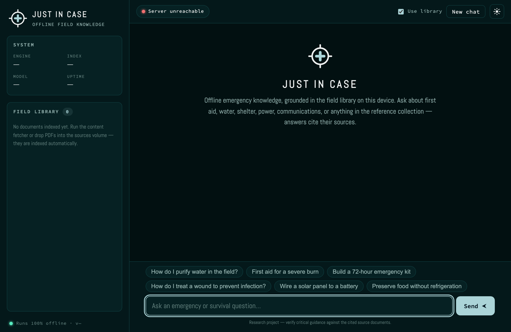
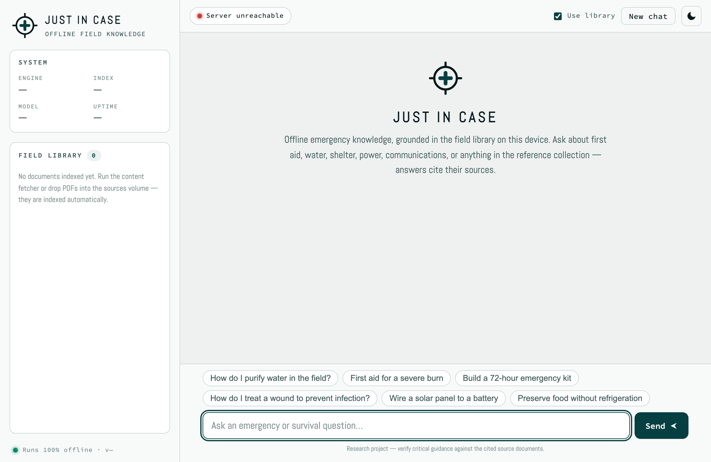
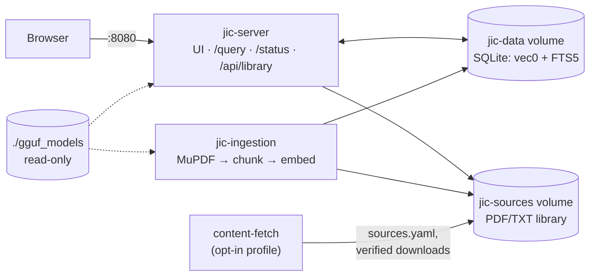
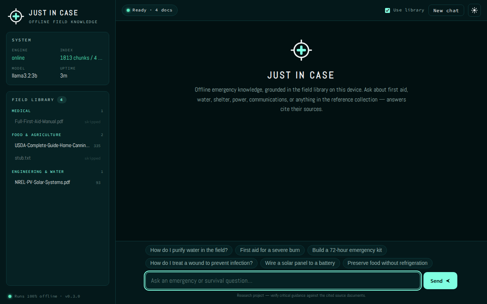
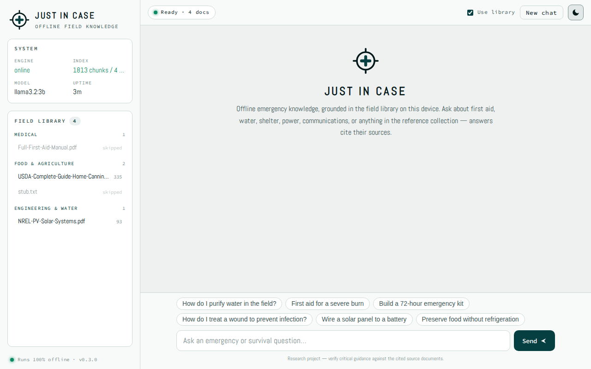
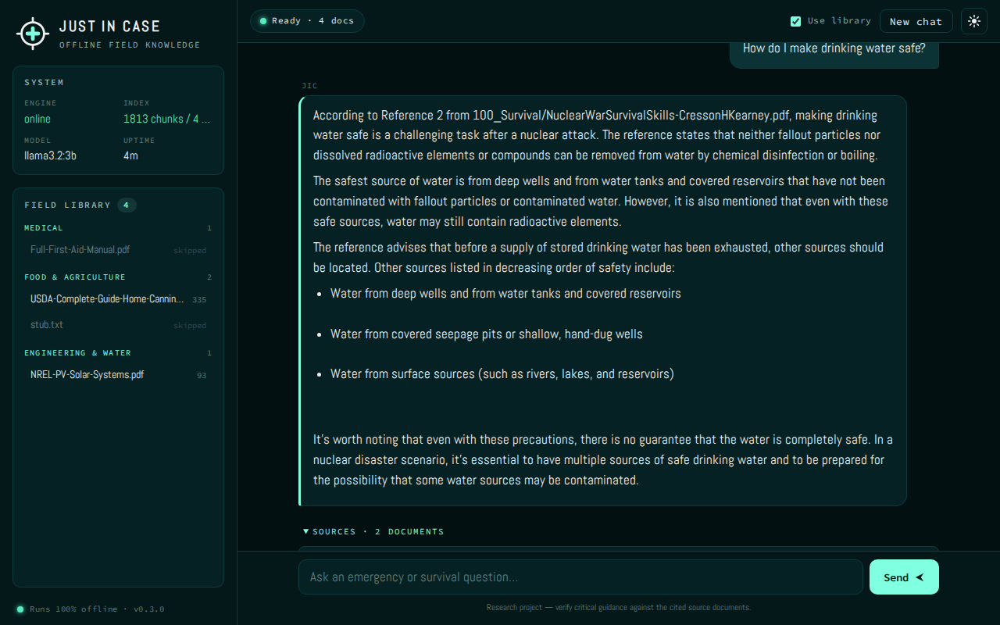
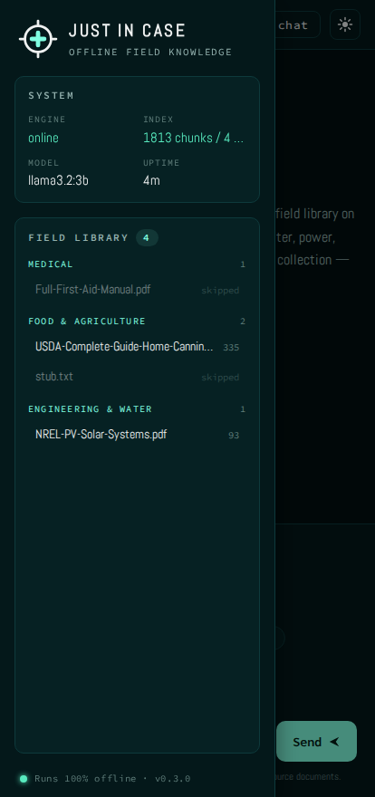

# Just In Case

**Offline emergency knowledge search.**

[Live demo](https://jic.companionintel.com) · [CompanionIntelligence.com/JIC](https://companionintelligence.com/JIC) · [Discord](https://discord.gg/companion)

JIC is a self-contained, LLM-powered conversational search engine that runs entirely offline on commodity hardware. You feed it emergency PDFs — survival guides, medical references, agricultural manuals, engineering resources — and it lets you ask questions in natural language and get grounded, source-attributed answers. No cloud, no network, no JVM, no Python. Just C++ and a few GGUF model files.

> **Research project.** Do not rely on this for real-world use at this time. Use at your own risk.

---

## Interface

A single-page, fully-offline UI on the [Companion Intelligence design system](https://github.com/companionintelligence/CI-Common/tree/main/style) — CI teal accent, self-hosted fonts (no CDN), light + dark themes.

| Dark | Light |
| --- | --- |
|  |  |

## Why

We lean heavily on ChatGPT, Claude, Google, and similar services for even simple practical questions — _how do I wire batteries to a solar panel_, _what causes lower-right abdominal pain_. During a prolonged crisis those services may not be available. JIC bridges that gap: an offline conversational interface to actionable emergency knowledge that fits on a single machine.

Background thinking on the problem space is in the [docs/](docs/) folder: [typical emergency questions](docs/1100-questions.md), [user personas](docs/1200-persona.md), [data categorisation](docs/1300-categorization.md), [high-value sources](docs/1400-sources.md), [target hardware](docs/1500-hardware.md), and [architecture notes](docs/1600-architecture.md).

---

## How it works

The system is written in C++17 and compiles to two binaries: a server and an ingestion worker. Both link against [llama.cpp](https://github.com/ggml-org/llama.cpp) for LLM inference and embeddings, [MuPDF](https://github.com/ArtifexSoftware/mupdf) for PDF text extraction, and SQLite with [sqlite-vec](https://github.com/asg017/sqlite-vec) and FTS5 for hybrid search. The server uses [cpp-httplib](https://github.com/yhirose/cpp-httplib) for HTTP. The default LLM is Llama 3.2 3B Instruct (Q4_K_M, ~2 GB); embeddings use nomic-embed-text-v1.5 (768-dimensional, ~260 MB).

**Content lives in volumes, not in the image.** The container image holds only the binaries and the web UI; the document library (`jic-sources` volume), the search index (`jic-data` volume), and the GGUF models (`./gguf_models` bind mount) are all provisioned at runtime. That keeps the image small, lets you update the library without rebuilding, and means a `docker compose down -v` is the only thing that can delete your data.



| Component | What it does | Where |
|---|---|---|
| `jic-server` | Hybrid retrieval (vector + BM25 → RRF), grounded generation, web UI, library API | `src/server.cpp` |
| `jic-ingestion` | Watches the library, extracts text in-process with MuPDF, chunks (~1500 chars, 200 overlap), embeds, indexes | `src/ingestion.cpp` |
| `content-fetch` | One-shot library downloader: seeds starter docs, fetches the curated manifest with checksum/magic-byte verification and atomic writes | `helper-scripts/fetch-source-data.sh` |
| Web UI | Dependency-free vanilla JS matching the [ci.computer](https://ci.computer) brand; live library panel, citations, dark/light | `public/` |

**Schema at a glance** — one SQLite file (`data/jic.db`, WAL) holds the entire index:

| Object | Type | Purpose |
|---|---|---|
| `chunks` | table | Chunk text + provenance (filename, order) |
| `vec_chunks` | sqlite-vec `vec0` | 768-d embeddings, ANN search |
| `chunks_fts` | FTS5 | BM25 lexical index (trigger-synced) |
| `processed_files` | table | Ingestion bookkeeping → `/api/library` |

The full implementation reference — query/ingestion pipelines, ER diagram, API contract, security model, failure modes, all as diagrams and tables — is in **[architecture.md](architecture.md)**.

Docker is used only for packaging — there is no runtime dependency on it. You can build and run natively if you prefer.

---

## Quickstart

You need [Docker and Docker Compose](https://docs.docker.com/get-docker/), roughly 4 GB of disk for models, and whatever space your library requires (the full curated catalog is ~350 MB).

### 1. Download models

Models must be present before starting Docker — they are not fetched at runtime.

```bash
./helper-scripts/fetch-models.sh
```

This places two GGUF files in `./gguf_models/`: `Llama-3.2-3B-Instruct-Q4_K_M.gguf` (~2.0 GB, the LLM) and `nomic-embed-text-v1.5.Q4_K_M.gguf` (~260 MB, the embedding model).

### 2. Build and run

```bash
docker compose up --build -d
```

The multi-stage Docker build compiles everything from source, then starts the server on port 8080 and the ingestion worker alongside it.

### 3. Load the library

JIC does not bake data into the image. A curated, URL-verified manifest of public-domain and freely-redistributable emergency documents lives in [sources.yaml](sources.yaml) — survival manuals, austere medicine, food preservation, water/power engineering, emergency comms, open textbooks. Download it into the content volume:

```bash
docker compose --profile fetch run --rm content-fetch
```

The fetcher seeds the volume with any repo-committed starter documents, then downloads the manifest (atomically — the ingester never sees partial files). The ingestion worker picks up new files within ~30 seconds and indexes them; progress is visible in the web UI's library panel.

To add your own documents:

```bash
docker compose cp my-manual.pdf jic-server:/app/public/sources/100_Survival/
```

Once models and sources are loaded, no internet connection is required.

### 4. Ask questions

The web UI is at [http://localhost:8080](http://localhost:8080). You can also query the API directly:

### User flow at a glance

| # | You do | JIC does |
|---|---|---|
| 1 | `fetch-models.sh` | GGUF models land in `./gguf_models/` |
| 2 | `docker compose up --build -d` | Server + ingestion start; UI live (degraded until models present) |
| 3 | `--profile fetch run content-fetch` | Library volume seeded + verified catalog downloaded |
| 4 | wait ≤ 30 s | New documents are discovered, chunked, embedded, indexed — watch the library panel fill |
| 5 | ask a question | Hybrid search grounds the LLM; answer cites its sources |
| 6 | click a citation | Original document opens from `/sources/...` |
| 7 | `docker compose cp my.pdf jic-server:/app/public/sources/<category>/` | Your own documents join the index on the next scan |

```bash
curl -s -X POST http://localhost:8080/query \
  -H "Content-Type: application/json" \
  -d '{"query": "How do I purify water in the wild?"}'
```

| Endpoint | Method | Purpose |
|---|---|---|
| `/query` | POST | RAG question answering (`query`, optional `conversation_id`, `use_context`) |
| `/status` | GET | Version, uptime, model/index state |
| `/api/library` | GET | Indexed documents with category and chunk counts |
| `/sources/<path>` | GET | The source documents themselves |

---

## Configuration

To swap the LLM, set `LLM_GGUF_FILE` in the environment or edit `docker-compose.yml`. Any GGUF-format instruction-tuned model should work. A few reasonable options for different hardware budgets:

| Model | Parameters | RAM | Notes |
|---|---|---|---|
| **Llama 3.2 3B** (default) | 3B | ~3 GB | Fast, good quality, fits comfortably in 8 GB |
| Phi-4-mini | 3.8B | ~3.5 GB | Strong reasoning for its size |
| Gemma 3 4B | 4B | ~4 GB | Broad general knowledge |
| Llama 3.1 8B | 8B | ~6 GB | Better answers, needs ≥16 GB RAM |

Additional environment knobs (all optional):

| Variable | Default | Purpose |
|---|---|---|
| `JIC_SOURCES_DIR` | `public/sources` | Library location |
| `JIC_DB_PATH` | `data/jic.db` | SQLite index location |
| `JIC_SCAN_INTERVAL_SEC` | `30` | Ingestion scan cadence |
| `JIC_CORS_ORIGIN` | _(unset — CORS disabled)_ | Allow cross-origin API access for a specific origin |

## Security posture

The appliance is hardened by default: containers run as a non-root user with a read-only root filesystem, all capabilities dropped, and `no-new-privileges` set. The server sends a strict Content-Security-Policy on HTML, rejects oversized request bodies (1 MB) and queries (8 000 chars), validates all input (client errors are 400s, never 500s), and ships with CORS disabled — same-origin only — unless `JIC_CORS_ORIGIN` is set. If the GGUF models are missing the server degrades gracefully: the UI and library stay reachable and `/query` answers 503.

## Testing

```bash
make -C tests/unit                 # chunker unit tests (no deps)
./helper-scripts/test-config.sh    # static config/consistency lint
./helper-scripts/test-server.sh    # runtime tests against a live server
helper-scripts/fetch-source-data.sh --validate   # manifest lint
```

CI runs all of the above plus a Playwright screenshot gate before publishing the container image.

---

## Screenshots

UI theme matches the [ci.computer](https://ci.computer) brand — teal-black base, mint accent, Abel + Source Code Pro (bundled, offline).

| Dark (default) | Light |
|---|---|
|  |  |

| Grounded answer with citations | Mobile · library drawer |
|---|---|
|  |  |

---

## Contributing

Work in progress — contributions welcome. See the [Discord](https://discord.gg/companion) for discussion. Content additions to [sources.yaml](sources.yaml) must be public-domain or explicitly redistributable, with the license recorded — see [docs/1400-sources.md](docs/1400-sources.md) for the research backlog (Project NOMAD, PrepperDisk, Kiwix and friends).

## License

See [LICENSE](LICENSE).
