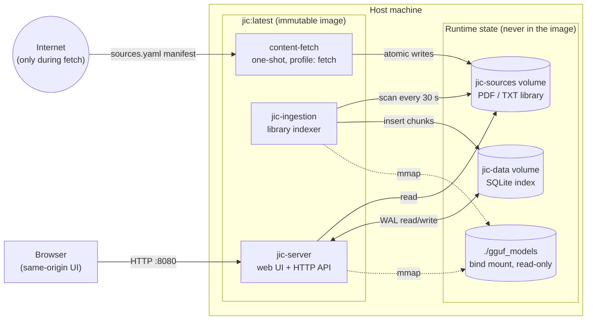
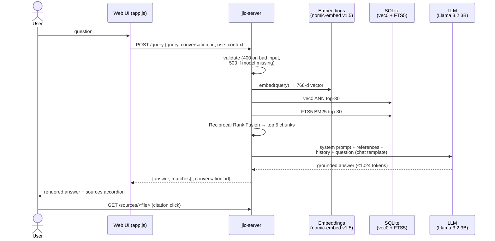
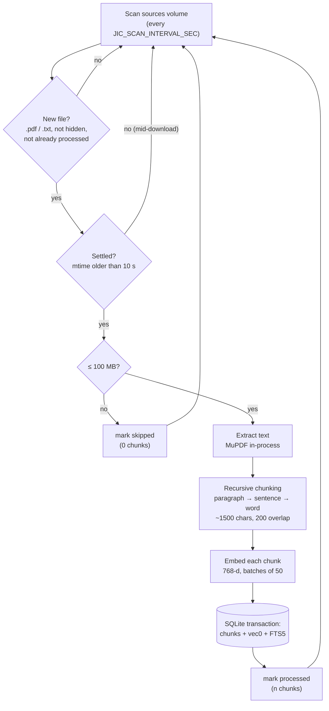
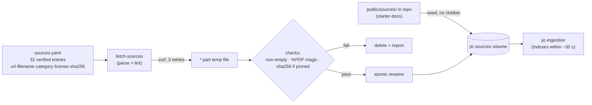
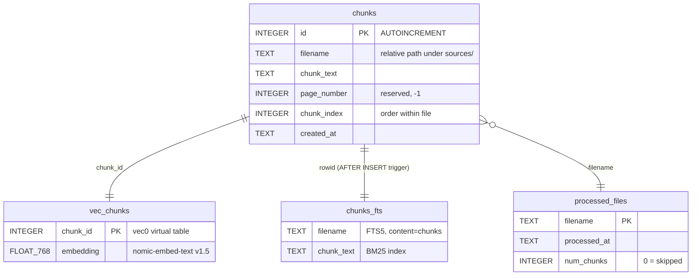
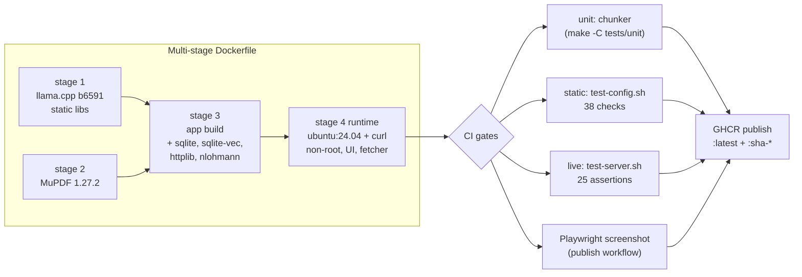

# JIC — System Architecture

> Implementation reference for **Just In Case**, the offline emergency knowledge
> assistant. Design-history narrative lives in
> [docs/1600-architecture.md](docs/1600-architecture.md); this document describes
> the system as built. Private & Confidential — Property of Lifescope Inc.

JIC is two C++17 binaries sharing one SQLite file, packaged as a single
container image. **The image is code; the volumes are state.** Everything else
follows from that rule.

---

## 1. System topology

| Service | Binary / entry | Role | Resources | Network |
|---|---|---|---|---|
| `jic` | `./jic-server` | Serves UI, `/query`, `/status`, `/api/library`, `/sources/*` | ≤ 8 GB RAM | Listens on `:8080` only |
| `ingestion` | `./jic-ingestion` | Watches the sources volume, extracts/chunks/embeds into SQLite | ≤ 4 GB RAM, 2 CPUs | None |
| `content-fetch` | `/app/bin/fetch-sources` | Opt-in (`--profile fetch`): seeds starter docs, downloads the manifest | one-shot | Outbound HTTPS only |

All services run as the non-root `jic` user on a read-only root filesystem with
`cap_drop: ALL`, `no-new-privileges`, and a tmpfs `/tmp`. Only the two named
volumes are writable.

---

## 2. User flow

| # | Actor step | System response |
|---|---|---|
| 1 | `./helper-scripts/fetch-models.sh` | GGUF models land in `./gguf_models/` (LLM ~2 GB, embeddings ~260 MB) |
| 2 | `docker compose up --build -d` | Image builds; server + ingestion start; UI live at `:8080` (degraded if models missing) |
| 3 | `docker compose --profile fetch run --rm content-fetch` | Library volume seeded + curated catalog downloaded with integrity checks |
| 4 | *(wait ≤ 30 s)* | Ingestion discovers settled files, indexes them; library panel fills in live |
| 5 | Ask a question in the UI | Hybrid retrieval grounds the LLM; answer renders with source citations |
| 6 | Click a citation | The original PDF/TXT serves from `/sources/<path>` |
| 7 | `docker compose cp my.pdf jic-server:/app/public/sources/<category>/` | Own documents join the library on the next scan |

---

## 3. Query pipeline

Why hybrid retrieval: vector search catches paraphrases ("stop the bleeding" →
hemorrhage control); BM25 catches exact terms (drug names, "FM 21-76"). The two
ranked lists merge with RRF (`score = Σ 1/(60 + rank)`), needing no score
normalisation between cosine distance and BM25.

---

## 4. Ingestion pipeline

Crash safety: the content fetcher writes `*.part` then renames (atomic on the
same filesystem), the settle window guards against files copied in by hand, and
a SIGTERM mid-document leaves it unmarked so the next run re-ingests it whole.
SQLite WAL lets the server read while ingestion writes.

---

## 5. Content provisioning

The manifest is the licensing record: every entry carries `license:` and only
public-domain / Creative-Commons / explicitly-redistributable documents are
accepted (see [docs/1400-sources.md](docs/1400-sources.md)). Catalog scope
follows what comparable offline builds ship (Project NOMAD, PrepperDisk):
military field manuals, austere medicine, food preservation, water/power
engineering, emergency comms, open textbooks, civic texts.
`fetch-source-data.sh --validate` lints the manifest in CI.

---

## 6. Storage schema

One SQLite file (`data/jic.db`, WAL mode) holds everything:

| Object | Type | Purpose |
|---|---|---|
| `chunks` | table | Chunk text + provenance; the single source of truth |
| `vec_chunks` | `vec0` virtual table (sqlite-vec) | 768-d embeddings, ANN search via `MATCH` |
| `chunks_fts` | FTS5 virtual table | BM25 lexical index, kept in sync by trigger `chunks_ai` |
| `processed_files` | table | Ingestion bookkeeping; feeds `/api/library` (`num_chunks = 0` ⇒ shown as *skipped*) |

---

## 7. HTTP API

| Endpoint | Method | Body / params | Success | Errors |
|---|---|---|---|---|
| `/` , `/app.js`, `/style.css`, `/assets/*` | GET | — | static UI (CSP on HTML) | 404 |
| `/sources/<path>` | GET | — | original document | 404 |
| `/query` | POST | `{query, conversation_id?, use_context?}` | `{answer, matches[], conversation_id}` | 400 invalid input · 413 body > 1 MB · 503 model not loaded · 500 |
| `/status` | GET | — | `{version, uptime_seconds, documents_indexed, files_processed, llm_loaded, embeddings_loaded, llm_model, embedding_model}` | — |
| `/api/library` | GET | — | `{files[{filename, category, chunks, size_bytes, indexed_at, status}], total_files, total_chunks}` | — |

Input contract: `query` 1–8000 chars; `conversation_id` `[A-Za-z0-9_-]{1,128}`;
client mistakes are 400s, never 500s. Conversations are in-memory only, pruned
after 1 h idle, bounded at 200.

---

## 8. Configuration

| Variable | Default | Used by | Purpose |
|---|---|---|---|
| `LLM_GGUF_FILE` | `Llama-3.2-3B-Instruct-Q4_K_M.gguf` | server, scripts | LLM file inside `gguf_models/` |
| `EMBEDDING_GGUF_FILE` | `nomic-embed-text-v1.5.Q4_K_M.gguf` | server, ingestion, scripts | Embedding model file |
| `LLM_MODEL` / `EMBEDDING_MODEL` | `llama3.2:3b` / `nomic-embed-text` | `/status` | Display names |
| `JIC_SOURCES_DIR` | `public/sources` | server, ingestion | Library location |
| `JIC_DB_PATH` | `data/jic.db` | server, ingestion | Index location |
| `JIC_SCAN_INTERVAL_SEC` | `30` (min 5) | ingestion | Scan cadence |
| `JIC_CORS_ORIGIN` | *(unset = CORS off)* | server | Opt-in cross-origin access |
| `LLM_GGUF_REPO` / `NOMIC_GGUF_REPO` | bartowski / nomic-ai | `fetch-models.sh` | HuggingFace download repos |

Retrieval/runtime constants (compile-time, `src/config.h`):

| Constant | Value | Meaning |
|---|---|---|
| `CHUNK_SIZE` / `CHUNK_OVERLAP` | 1500 / 200 chars | Chunking geometry |
| `MAX_CONTEXT_CHUNKS` | 5 | References handed to the LLM |
| `SEARCH_CANDIDATES` | 30 | Per-index candidates before RRF |
| `LLM_CONTEXT_SIZE` / `LLM_MAX_TOKENS` / `LLM_BATCH_SIZE` | 8192 / 1024 / 512 | Token window / answer cap / decode batch |
| `EMBEDDING_DIM` | 768 | nomic-embed-text v1.5 |
| `MAX_REQUEST_BODY` / `MAX_QUERY_CHARS` | 1 MB / 8000 | Input bounds |
| `MAX_DOCUMENT_CHARS` | 8,000,000 | Per-document text cap |
| `FILE_SETTLE_SECONDS` | 10 | Ingestion settle window |

---

## 9. Security model

| Layer | Control |
|---|---|
| Container | Non-root uid 10001, read-only rootfs, `cap_drop: ALL`, `no-new-privileges`, tmpfs `/tmp`, `init: true` |
| Image | No knowledge content, no shells in entrypoint path, OCI labels, models/data never baked in |
| HTTP | CSP on HTML (`script-src 'self'`, no inline), `X-Content-Type-Options: nosniff`, `X-Frame-Options: DENY`, `Referrer-Policy` |
| CORS | Disabled by default; single-origin opt-in via `JIC_CORS_ORIGIN` |
| Input | 1 MB body cap, query length cap, conversation-id charset allow-list, 400-not-500 discipline |
| Content | Manifest-pinned URLs, PDF magic-byte check, optional SHA-256, atomic publishes, license recorded per document |
| Degradation | Missing models ⇒ UI + `/status` + library stay up, `/query` → 503; missing volume ⇒ empty library, no crash |

---

## 10. Build & test

| Suite | Scope | Command |
|---|---|---|
| Unit | Chunker invariants (lossless split, size bounds, overlap) | `make -C tests/unit` |
| Static | Repo consistency, manifest lint, image hygiene, UI wiring | `./helper-scripts/test-config.sh` |
| Live | API contract, security headers, validation, degraded mode, e2e query | `./helper-scripts/test-server.sh` |
| UI gate | Non-blank rendered UI + screenshot artifact | `tests/container` (CI) |

---

## 11. Failure modes

| Condition | Behaviour |
|---|---|
| GGUF models absent | Degraded mode: UI/status/library OK, `/query` → 503 with instructions |
| Prompt exceeds decode batch | Chunked `llama_decode` slices (a single oversized batch aborts llama.cpp — fixed) |
| Half-written file in library | Skipped until settled; fetcher renames atomically |
| Oversized / image-only PDF | Marked `skipped`, surfaced in the library panel (no OCR yet) |
| SIGTERM mid-ingest | Document left unmarked → fully re-ingested on restart |
| SQLite contention | WAL mode; single writer (ingestion), concurrent readers |
| Conversation memory growth | 1 h idle pruning + hard cap of 200 conversations |

## 12. Known gaps / next steps

- No OCR for scanned PDFs (MuPDF extracts text layers only)
- Page-level citation anchors (per-page text already available)
- Re-index on file change (hash-based) rather than name-based dedupe
- Kiwix ZIM ingestion and offline map tiles as sibling services
- pgvector escape hatch if collections outgrow one SQLite file
