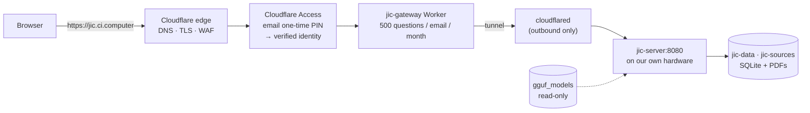

# Hosting JIC at `jic.ci.computer`

How the offline assistant gets a public address without stopping being offline,
and how a single box survives being on the internet.

> **Private & Confidential — Property of Lifescope Inc. Do not distribute.**

---

## What "deployed to Cloudflare" means here, and what it cannot mean

JIC is a C++ binary that links llama.cpp, MuPDF and SQLite, loads a ~4.3 GB
GGUF model into memory, and answers questions with CPU inference against a
SQLite index on a writable volume.

**None of that can run on Cloudflare's compute.** Workers execute
JavaScript/WASM in a V8 isolate with a memory ceiling far below the model
alone; Containers are not a place to do multi-second CPU inference against a
multi-gigabyte weights file. There is no version of this where `jic-server`
becomes a Worker.

So Cloudflare is used for exactly what it is good at — **identity, metering,
TLS and reachability** — and the product keeps running where it was designed
to run:



The box holds the documents, the index and the model, and never accepts an
inbound connection. Pull the tunnel and it is the same offline appliance it
always was — which is the point of the product, not an implementation detail.

### Why a tunnel rather than a port forward

`cloudflared` dials *out* to Cloudflare and keeps the connection open. The
origin therefore needs no public IP, no inbound firewall hole, and no
certificate of its own. For a machine sitting on an office or home network,
that is the difference between publishing one service and exposing a host.

---

## The access model

Two separate jobs, deliberately split:

| Job | Who does it | Why there |
|---|---|---|
| Prove the visitor owns an email address | **Cloudflare Access**, one-time PIN | It is an identity provider; we should not build a login |
| Limit what a visitor may spend | **`jic-gateway` Worker** | Access has no notion of "500 questions a month" |

**Access here collects identity; it does not restrict membership.** The policy
allows *any* email address to receive a PIN, so anyone can sign in — after
proving they can read mail at the address they gave. Cloudflare's own docs flag
an unrestricted-OTP policy as a security consideration, and they are right to:
on its own it protects nothing. That is precisely why the quota exists. The
pairing is deliberate —

- **verified email** gives us an accountable identity per visitor, and a
  contact list as a by-product;
- **the monthly cap** is what actually protects the hardware, because the
  thing behind the tunnel is one box doing CPU inference, not elastic cloud
  capacity.

Either one alone would be a mistake. An unmetered open endpoint is an
invitation to spend someone else's CPU; a metered anonymous one has nothing to
meter against.

### What is metered

Only `POST /query` — the request that runs the model. The UI, `/status` and
`/api/library` are cheap and stay free, so a signed-in visitor can always
browse the library and see system state even with their allowance spent.

| Path | Metered | Note |
|---|---|---|
| `GET /` + assets | no | static |
| `GET /status` | no | cheap |
| `GET /api/library` | no | cheap |
| `POST /query` | **yes** | one unit per *answered* question |

A question the box fails to answer is **refunded**: if the origin returns 5xx
(including a Cloudflare 524 timeout), the reservation is released and the
visitor is not charged for a failure that was ours.

---

## Setup

### 1. DNS

`ci.computer` must be on Cloudflare. Add a proxied record for the hostname —
creating the tunnel's public hostname (step 2) does this automatically, so
there is usually nothing to do by hand. The record **must stay proxied**
(orange cloud): grey-clouded, Access and the Worker are both bypassed and the
origin is naked.

### 2. The tunnel

In **Zero Trust → Networks → Tunnels → Create a tunnel**, choose
*Cloudflared*, name it `jic-prod`, and copy the token.

On the box:

```bash
echo 'CLOUDFLARE_TUNNEL_TOKEN=eyJhIjoi...' >> .env
docker compose --profile tunnel up -d
```

Then give the tunnel a **public hostname**:

| Field | Value |
|---|---|
| Subdomain | `jic` |
| Domain | `ci.computer` |
| Service | `http://jic:8080` |

`jic:8080` is the service name on the compose network — the tunnel reaches the
server container directly, so the `ports:` mapping on the `jic` service is
only a localhost convenience and can be removed entirely on a deployed box.

Ingress for a token-run tunnel is configured **remotely**, in the dashboard. A
local `config.yml` is ignored; do not add one and expect it to take effect.

Verify from the host:

```bash
curl -s http://localhost:2000/ready    # cloudflared: edge connections up?
```

### 3. Access application (email collection)

**Zero Trust → Access → Applications → Add → Self-hosted**:

| Field | Value |
|---|---|
| Application name | `JIC` |
| Domain | `jic.ci.computer` |
| Identity providers | **One-time PIN** |
| Session duration | 1 week (a shorter session means more PIN emails) |

Add one policy — action **Allow**, include **Login Methods → One-time PIN** —
which admits any address that can receive its code. Restrict the include rule
to an email list or domain later if this should stop being open; the Worker
needs no change either way.

From the application's overview, copy the **Application Audience (AUD) tag**.
It goes in the Worker config.

### 4. The quota Worker

```bash
cd deploy/cloudflare/worker
npm install
```

Edit `wrangler.jsonc`:

| Var | Value |
|---|---|
| `TEAM_DOMAIN` | `https://<team>.cloudflareaccess.com` |
| `POLICY_AUD` | the AUD tag from step 3 |
| `MONTHLY_QUERY_LIMIT` | `500` |
| `GLOBAL_MONTHLY_LIMIT` | optional ceiling across everyone |

```bash
npx wrangler deploy
npx wrangler tail          # watch live
```

The route is `jic.ci.computer/*` on zone `ci.computer`, the same hostname as
the tunnel — the Worker is a filter *in front of* the box, not a second
address for it.

Counters live in a **Durable Object**, one per identity, keyed by month. A
Durable Object rather than KV because KV is eventually consistent: two
simultaneous questions could both read `used = 499` and both be allowed. Every
request for one identity is serialised through one object, so the
read-modify-write cannot interleave. Consider also setting
`GLOBAL_MONTHLY_LIMIT` — forty users at 500 each is 20,000 CPU inferences, and
the per-user cap alone says nothing about aggregate load.

The store holds a **SHA-256 hash** of each address, not the address. Access
already holds the verified identity; the counter has no reason to keep a
second copy of everyone's email.

---

## Operating it

### Quota headers

Every answered query carries its own accounting:

```
X-JIC-Quota-Limit: 500
X-JIC-Quota-Used: 37
X-JIC-Quota-Remaining: 463
X-JIC-Quota-Reset: 2026-10-01T00:00:00.000Z
```

Over the cap, `POST /query` returns **429** with a plain-language `error` —
the field `public/app.js` renders — so the UI shows "You have used all 500 of
your questions for this month. The allowance resets on 1 October 2026."
rather than a bare status code. Months are **UTC calendar months**.

### Raising or lowering the cap

Edit `MONTHLY_QUERY_LIMIT` and redeploy. The limit is read per request, not
baked into stored counters, so a change applies immediately to everyone,
including visitors already over the old ceiling.

### The timeout that will bite first

Cloudflare's proxy read timeout is **100–120 s by default, and configurable
only on Enterprise**. A long answer generated on CPU can exceed that, and the
visitor gets a **524** — which the Worker refunds, but does not prevent.

Before reaching for an Enterprise plan, make the answers fit the budget:

- cap generated tokens in the server's generation settings;
- keep `JIC_N_GPU_LAYERS` > 0 on a box with a GPU (needs a GPU build — see the
  compose comments), which is the single biggest win;
- prefer a smaller/faster quantisation if answers are routinely slow.

This is the one constraint that makes a hosted JIC feel different from a local
one, so measure it before inviting users.

### Turning it off

```bash
docker compose --profile tunnel down      # hostname stops resolving to us
```

The appliance keeps working on `localhost:8080` throughout — nothing about the
offline product depends on the tunnel being up.

---

## Local development of the Worker

The quota can be exercised with no Cloudflare account at all: serve a JWKS at
`/cdn-cgi/access/certs` from a local server, mint a token with the matching
key, point `TEAM_DOMAIN` at it, and set `ORIGIN_BASE_URL` at a stub that
answers `/query`. See `deploy/cloudflare/worker/.dev.vars.example`.

```bash
cd deploy/cloudflare/worker
npm run typecheck
npx wrangler dev --local
```

`ORIGIN_BASE_URL` is unset in production: the Worker shares its hostname with
the tunnel, so a plain `fetch(request)` already reaches the box.

---

## Security notes

- The **tunnel token is a bearer credential** for the hostname. It lives in
  `.env` (gitignored), reaches the container through the environment rather
  than `command:` — anything in argv is visible to `docker inspect` and every
  `ps` on the host — and should be rotated by deleting and recreating the
  tunnel if it leaks.
- `TEAM_DOMAIN` and `POLICY_AUD` are **not** secrets: the AUD tag is a public
  identifier and tokens are verified against Cloudflare's published JWKS.
- The Worker **fails closed**. No valid Access assertion means 401, never an
  unmetered pass to the origin — so a Worker route that outlives its Access
  application degrades to "nobody can query", not "everybody can, free".
- Keep the hostname proxied. A grey-clouded record bypasses Access and the
  Worker entirely.
